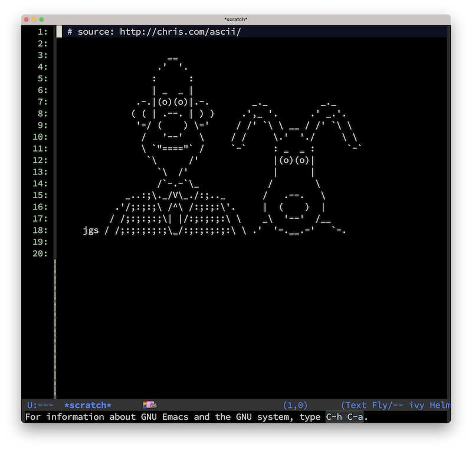

# emacs.d


A fast, focused Emacs configuration for macOS. The configuration is written as a literate [Org](https://orgmode.org/) document, tangled and byte-compiled so startup stays quick, with packages and language tooling loaded only when you need them.



## What's inside

- **Fast startup** — the config is byte-compiled and loaded directly; Org itself loads lazily (only when you open an `.org` file), and heavy packages are deferred until first use.
- **Modern completion** — Vertico, Consult, Marginalia and Orderless in the minibuffer; Company for in-buffer completion.
- **Project & version control** — Projectile and Magit.
- **Navigation & editing** — `which-key`, Flycheck, yasnippet, ace-jump, highlight-symbol, and a file tree (`f8` / `M-0`).
- **Python (on demand)** — LSP via `pylsp`, plus Black, isort and pytest; nothing Python-related loads until you open a `.py` file.
- **Markdown** — export and preview via pandoc (`C-c C-c e` / `p` / `v`) and Org-style structure editing (`M-<arrows>` to move, promote and demote).
- **Optional setup wizard** — installs missing system tools on request, never on its own (`M-x ar-setup-wizard`).

## Requirements

- **Emacs 29 or newer** (developed and tested on 30.2; native compilation recommended)
- **git**
- **macOS** — the configuration and its Mac-specific keybindings are developed and tested there
- Optional: **pandoc** (Markdown export), **aspell** (spell-checking), **pipx** (Python LSP)

## Installation

### One-line install (recommended)

```bash
curl -fsSL https://raw.githubusercontent.com/REPPL/emacs.d/main/install.sh | bash
```

This clones the configuration into `~/.emacs.d` as a git repository, so you can pull updates and commit your own changes. If `~/.emacs.d` already exists you are asked what to do first — nothing is deleted without your consent (an existing configuration is moved to `~/.emacs.d.backup-<timestamp>`; if `~/.emacs.d` is already this configuration, you are offered a `git pull` instead). After cloning, it offers to install any missing optional tools below (pandoc, aspell, pipx and the Python language server), each with its own y/N prompt. To install somewhere else, set `EMACS_D`:

```bash
curl -fsSL https://raw.githubusercontent.com/REPPL/emacs.d/main/install.sh | EMACS_D=~/my-emacs bash
```

### Manual install

```bash
# Back up any existing configuration first
mv ~/.emacs.d ~/.emacs.d.backup

# Clone directly to ~/.emacs.d
git clone https://github.com/REPPL/emacs.d.git ~/.emacs.d
```

## First launch

When you first start Emacs with this configuration:

1. **Package installation** — Emacs installs `use-package` and the packages declared in `inits/repp.org`, creating the `elpa/` directory.
2. **Tangle and compile** — the configuration is tangled from `inits/repp.org` to `inits/repp.el` and byte-compiled. The first launch takes a moment whilst packages download and the config compiles; later launches load the compiled config directly and are fast.
3. **Restart Emacs** — after packages install, restart once so everything loads cleanly.
4. **Optional setup wizard** — the editor works out of the box. If some optional system tools are missing, a single passive note points you at `M-x ar-setup-wizard`; it never blocks startup. The wizard installs missing tools (Python LSP via [pipx](https://pipx.pypa.io/), linters, a default Python venv), asking y/n for each — nothing installs without confirmation. It writes `.setup-done` in your Emacs directory once every category is complete; delete that file (or run with `C-u`) to re-run.

## Configuration

The configuration lives in three files:

- `init.el` — startup: sets up packages, then tangles, byte-compiles and loads the config
- `inits/repp.org` — the literate configuration; **edit this**, and it is re-tangled on the next launch
- `inits/custom.el` — variables and faces managed by `M-x customize`

## Auto-generated files

These are created automatically and are not committed:

- `elpa/` — installed packages
- `eln-cache/` — native-compiled code
- `inits/repp.el` and `inits/repp.elc` — tangled and byte-compiled from `repp.org`
- `auto-save-list/`, `recentf`, `projectile-bookmarks.eld`, `.lsp-session-v1` — session and runtime data
- `tramp`, `transient/`, `eshell/`, `tree-sitter/` — runtime data

## Troubleshooting

For installation and compilation issues, see [docs/troubleshooting/](docs/troubleshooting/).
