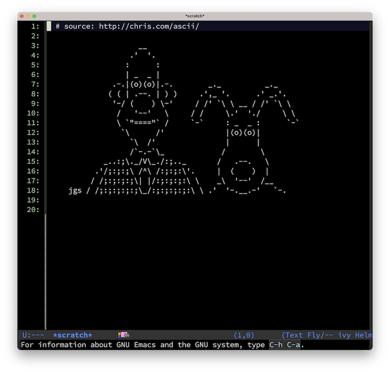

# emacs.d

My personal Emacs configuration.



## Troubleshooting

### Emacs Compilation Error: `aclocal failed`

If you encounter this error when compiling Emacs from source:
```
autoreconf: error: aclocal failed with exit status: 2
```

This means `automake` is missing. If you don't have sudo access to install via Homebrew, install automake locally:

1. Download automake:
   ```bash
   cd ~/Downloads
   
   # Option A: Get latest version automatically
   LATEST=$(curl -s https://ftp.gnu.org/gnu/automake/ | grep -oE 'automake-[0-9]+\.[0-9]+\.tar\.gz' | sort -V | tail -1)
   curl -O https://ftp.gnu.org/gnu/automake/$LATEST
   
   # Option B: Specific version (if automatic fails)
   curl -O https://ftp.gnu.org/gnu/automake/automake-1.17.tar.gz
   ```

2. Extract and build:
   ```bash
   tar -xzf automake-*.tar.gz
   cd automake-*/
   ./configure --prefix=$HOME/.local
   make
   make install
   ```

3. Add to PATH (add to ~/.zshrc or ~/.bash_profile):
   ```bash
   export PATH=$HOME/.local/bin:$PATH
   ```

4. Reload shell config:
   ```bash
   source ~/.zshrc  # or source ~/.bash_profile
   ```

Now `aclocal` should be available for Emacs compilation.
